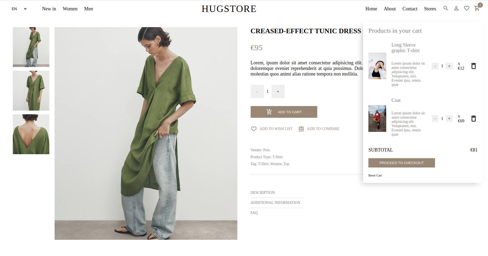

# [HugStore](https://hug-store-e-commerce-ii73bnm15-statuja.vercel.app/)

## Overview
This e-commerce website, was developed during my training as a web developer at DCI (Digital Career Institute). The project showcases my skills in front-end development, utilizing React with Vite as the build tool. Notably, this project does not currently have a backend and serves as a practice exercise by following tutoring on YouTube.

## Features
- React Components: The project is structured with reusable React components, promoting a modular and maintainable codebase.
- React Router: Navigation is handled seamlessly with React Router, enabling a smooth user experience with different pages.
- Navbar: The Navbar component offers easy navigation, language selection, and quick access to essential links, such as home, about, contact, and stores. It also includes icons for search, user login, favorites, and the shopping cart.
- User Authentication Popup: The SignUpPopup component provides a user-friendly interface for account registration and login, enhancing the overall user experience.
- Featured Products: The FeaturedProducts component dynamically renders product cards based on the provided data, allowing easy updates and additions to the showcased items.

- Categories: The Categories component provides an organized layout for different product categories, linking to respective pages for more details.
- Product Listing: The products component lists products based on selected filters, such as categories, price range, and sorting preferences.
- Product Display: The product component displays detailed information about a particular product, including multiple images, pricing, description, and additional details.


## Project Structure
- Pages: Different pages, such as Home, Product, and Products, are created as React components and managed by React Router.
- Components: Reusable components like Navbar, Footer, Card, and SignUpPopup enhance code modularity and maintainability.
- Styling: SCSS is employed for styling, providing a clean and structured approach to design.

## Getting Started 
1. Clone the repository: 
```
https://github.com/statuja/hugStore_e-commerce.git
```
2. Navigate to the project directory
3. Install dependencies:
```
npm install
```
4. Run the development server:
```
npm start
```

Visit http://localhost:3000 in your browser to view the application.

## Demo
[Live Demo](https://hug-store-e-commerce-ii73bnm15-statuja.vercel.app/)





